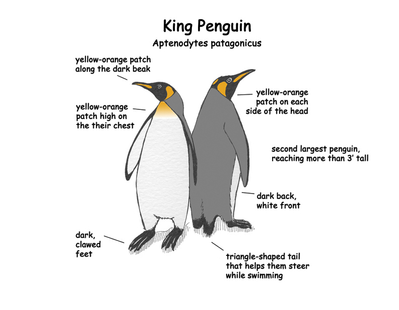

# DUX Dynamic Notice Iframes

* Author: Pedro Dousseau <pedro@dousseau.com>
* Copyright: Copyright 2017, Pedro Dousseau
* Credits: Pedro Dousseau
* License: GPLv3
* Maintainer: Pedro Dousseau
* Email: pedro@dousseau.com
* Status: Production

Create notice modal box on webpages from using iframes that point to other document that can be dynamically updated without always update the main code. The iframe will show once, set a cookie, and only display again when the cookie expirates.

## Usage

See example on iframe-example.html and page-example.html

#### Host document

Import the javascript library and call the function to create the iframe.

```
<script type="text/javascript" src="dux_dynamic_notices_iframe.js"></script>
<script type="text/javascript">
    // Sets a cookie that will expire in one day
    createDuxIframe('iframe-example.html', "cookie-name", 1);
</script>
```

#### Iframe document

Import the stylesheet.

```
<link rel="stylesheet" href="dux_dynamic_notices_iframe.css">
```

Create the html structure to the modal.

```
<body>
    <div class="dux-modal-wrapper">
        <div id="iframe-example" class="dux-modal-box" style="padding: 0;">
            <span class="material-icons dux-modal-close">&times;</span>
            
        </div>
    </div>
</body>
```

Import javascript library and call the function to create the modal.

```
<script type="text/javascript" src="dux_dynamic_notices_iframe.js"></script>

<!-- CREATE THE MODAL -->
<script type="text/javascript">
    window.onload = function() {
        setTimeout(function() {
            // Create the modal
            DuxNoticeModal(document.getElementById('iframe-example'));
        }, 1000);
    }
</script>
```
